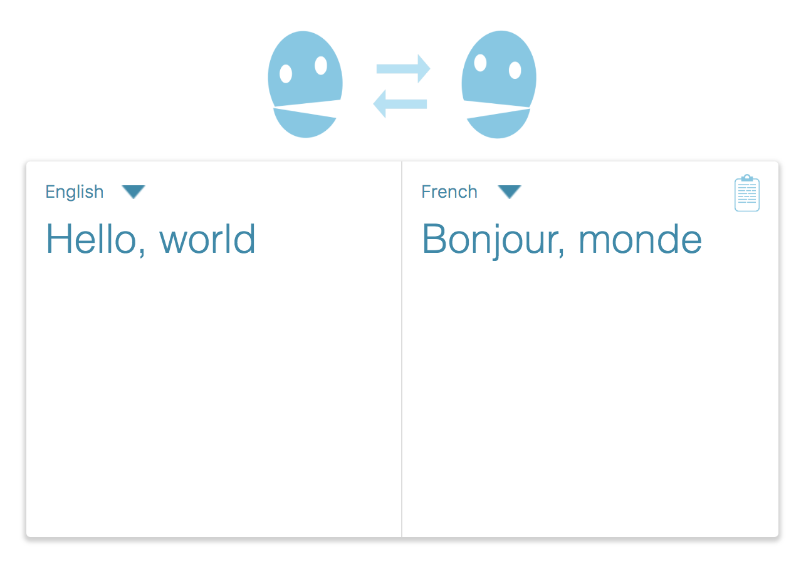

# Michael's Design Capstone Project

### Description

This project is an interface for IBM's Watson, which is a Natural Language Processing machine. Its current iteration uses Watson to provide real time text translation.

### Features

This web application offers near real time translation of text inputs into a wide variety of languages. A very short countdown timer (100ms) keeps track of users' inputs and sends out an API call to Watson's Natural Language Processor to convert the entered text to the desired output.

### Installation

Clone from GitHub repository, enter the created directory, then type `npm install`, `npm build`, `npm start`. You will find the web application in your browswer at https://localhost:3000

(I haven't done comprehensive installation testing and some additional libraries may be required, but I anticipate these steps should work. Please contact the author with any troubles!)

### Technologies Used

- JavaScript ES6
- CSS
- Express
- NodeJS
- IBM's Watson SDK

I've learned that a lot of front end web developer work is focused on building on top of existing technologies, and that's exactly what I set out to do with this project. This project stands on the shoulders of giants by sending API calls to a thoroughly advanced machine and letting it do the heavy lifting. Locally, the project sits on an Express service that lets it interface with IBM's Watson, and runs on a NodeJS platform.

The front end logic was originally written in React, but has since been refactored into vanilla JavaScript. It may

### Known Bugs

~~Text does not automatically resize when deleting; not sure if this is a logic issue or an issue related to how `keyup` works in JavaScript.~~ (Fixed!)

----

### To-Do:

- ~~Output language~~
  - ~~Drop down option~~
  - Auto populate or limit to 'safe' options
- ~~Input Language Control~~
  - ~~Drop down (easier)~~
  - Auto detect by default (harder)
- ~~Error handling for zero length inputs~~
- ~~Auto resize text based on character count~~
- Add option to translate two directionally
- Option for timer adjustment / manually enter
- Add indicator ('...') progress bar somewhere
- Documentation
- ~~Add option to auto copy~~
- Favicon
- ~~Add error catching language and notifications~~
- ~~Prettyify server start language~~
- Style dropdown menus (idea: https://codepen.io/afalchi82/pen/aNXjgb)
- Responsive design (vertical full screen box split)
- Find somewhere to incorporate goldenrod or salmon colors
- Refactor into React
- ~~Rename images/etc for cleanliness~~

### Scrapped To-Do:

- Output text to speech
  - Switch ports and run in parallel?
  - Double up services in same project
