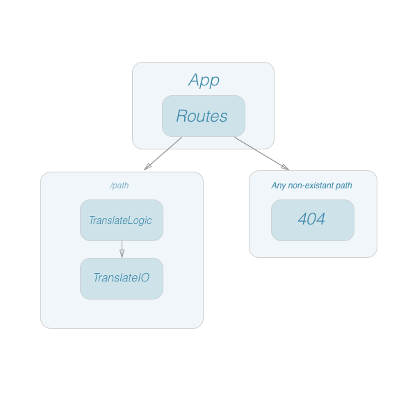

# React Fundamental & State Code Review

### Installation

Clone repository from GitHub, `npm install`, `npm start`. 

### Uses of State

My working assumption is that state will at the App.jsx level as everything immediately below it will need props; this may change when I implement routing and active link titles. I'm still wrapping my head around React and may not know until refactoring during next week.  

### Proposed (anticipated) component routing for Capstone project.

